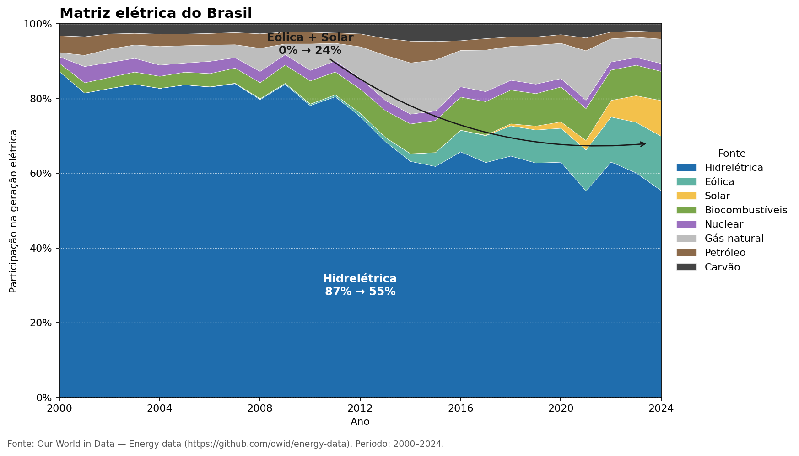

# Relatório

> [!CAUTION]
>
> - Você <ins>**não pode utilizar ferramentas de IA para escrever este relatório**</ins>.

## Identificação

- **Nome**: Fernando Tedesco
- **Cartão UFRGS:** 00591001
## Dados utilizados

> [!IMPORTANT]
>
> - Os dados utilizados devem ser informados como **links** para as fontes originais.
> - Se houver mais de um conjunto de dados, liste todos separadamente.
> - Para cada conjunto de dados, inclua também uma **descrição curta** explicando os dados.

1. **Dataset 1**: https://github.com/owid/energy-data
    * **Descrição curta**: Dataset de  fontes de energia da matriz elétrica mundial, filtrado apenas para mostrar a matriz brasileira. Dataset compilado pela "Our World in Data".

## Código-fonte da visualização

> [!IMPORTANT]
>
> - Indique abaixo onde está, dentro deste repositório, o código-fonte usado para gerar a visualização.

- **Arquivo principal**: plot.py

## Imagem da visualização gerada

## Descrição da visualização
Gráfico de área empilhada onde o eixo X corresponde ao ano e eixo Y a participação, em %, da geração de energia. Cada cor = uma fonte.
As anotações apenas servem para destacar a conclusão.
### Legenda 
Participação em % das principais fontes de energia da matriz elétrica brasileira.

### Conclusão demonstrada pela visualização

A participação das hidrelétricas caiu de ~87% para ~55%, mas foi compensada pelo crescimento da geração de energia eólica e solar, que estavam
extremamente marginalizadas/inexistentes até por volta de 2012. Isso significa que a queda de uma fonte de energia limpa e renovável (hidrelétrica) não foi compensada por usinas termoelétricas de petróleo e carvão, e sim da ascensão da matriz solar e eólica no Brasil.
